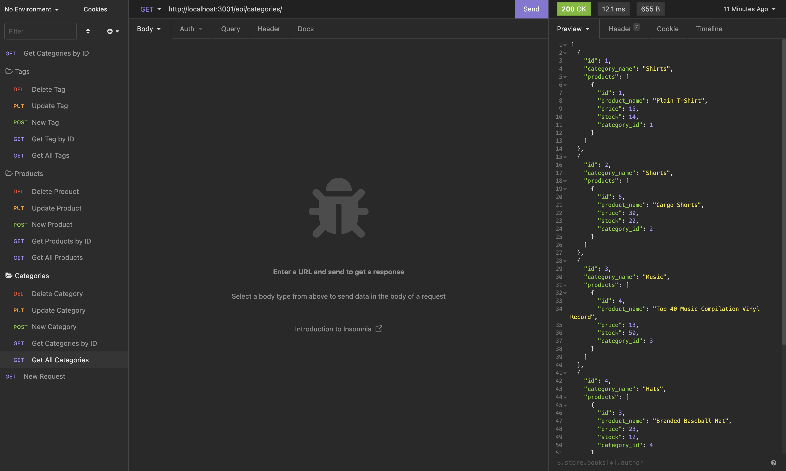

# Ecommerce Back End

This application allows the user to test routes in insomnia. Category, Product and Tag routes are set up, seeded and the following routes can be tested; get all, get by ID, post new, update and delete. 

## Table of Contents

- [Tech](#tech)
- [Installation](#installation)
- [Usage](#usage)
- [Contributing](#contributing)
- [Questions](#questions)
- [License](#license)

## Tech

---

The following technology was used in this project: JAVASCRIPT, EXPRESS, NODE, MYSQL.

## Installation

---

Initialize your database using ecommerce_db, seed your database using node seeds/index.js, run the program using node server.js. Then head to insomnia or postman to test the routes. 

## Usage

---

See installation

## Contributing

---

You can use the app but permission is needed from the creator to contribute alexis.dorrity@gmail.com

## Images

---

## Questions

---

For any questions you can reach out to:

Lexi

Email: alexis.dorrity@gmail.com

GitHub: https://github.com/Lexi-Diamond
